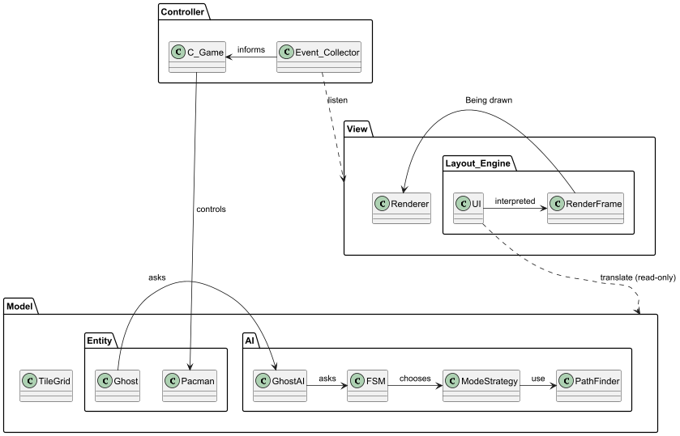

# Pacman-AP-2025-2026
Project for the course "Advanced programming", first semester of the second year of the bachelor's degree, 2025-2026


## MVC Architecture Overview

The project follows a clear **Model–View–Controller (MVC)** architectural pattern, which ensures separation of concerns, high testability, and independence of core game logic from rendering and input handling.

---

### Model

The **Model** layer contains all core game logic and domain rules and is fully independent from any rendering or platform-specific code.  
According to the documentation, this layer is primarily represented by the `model` namespace and includes:

- **World representation**: maze structure, tiles, and spatial data.
- **Game entities**: player character, ghosts, collectibles, and their state.
- **Game rules**: scoring system, life management, level progression, and collision logic.
- **Artificial intelligence**: ghost behavior implemented via strategy-based AI modes (`Chase`, `Scatter`, `Frightened`, and idle/house modes), located in `model::ai`.
- **State and events**: game state transitions and internal events used to notify other layers.

The Model does not depend on UI, rendering, or input systems, which allows it to be compiled and tested as a standalone library.

---

### View

The **View** layer is responsible solely for visual representation of the current game state.  
Based on the documentation, this functionality is encapsulated in UI- and rendering-related components (e.g. rendering systems, HUD, visual assets).

The View:
- reads data from the Model,
- subscribes to model events using an **Observer mechanism**,
- renders entities, maze, and UI elements (score, lives, states).

The View never modifies the game state directly and has no knowledge of game rules.

---

### Controller

The **Controller** layer acts as an intermediary between user input and the Model.  
It is responsible for:
- processing player input,
- triggering state changes in the Model,
- managing the main game loop and update cycle.

Controller logic invokes Model operations in response to input events but does not contain game rules itself.

---

### Component Interaction

The interaction between components follows strict dependency rules:

- **Controller → Model**: updates game state based on input and timing.
- **Model → View**: notifies the View of state changes via events/observers.
- **View → Controller**: no direct dependency.

This unidirectional dependency structure enforces clean separation and prevents tight coupling between gameplay logic and presentation.

---

### Architectural Rationale

This MVC-based design was chosen to:
- keep game logic independent from rendering and input,
- simplify future extensions (e.g. new AI modes, entities, or UI),
- allow reuse of the Model layer across different platforms or frontends.

The documented use of strategies for ghost AI and event-based communication further reinforces modularity and extensibility.

---



*Figure: High-level MVC architecture.  
The Model contains all core gameplay logic and AI, the View handles rendering and UI, and the Controller translates user input into model updates. Communication from Model to View is performed using an observer/event-based mechanism.*

- ### Smooth Continuous Movement

>Movement in the code is implemented as continuous and time-dependent, rather than frame-dependent.
All movements are calculated using delta time, which keeps the speed of objects stable at different refresh rates and does not depend on system performance.
Direction changes are processed sequentially and predictably, ensuring visually smooth movement and correct response to input.
This approach guarantees consistent movement logic behavior under all execution conditions.

```cpp 
void Actor::move(float deltaTime, const model::TileGrid &grid) { 
        if (speed() <= 0.f) return;
        float remaining_dist = speed() * deltaTime;
        const float EPS = grid.tile_size() * 0.001f;
        while (remaining_dist > EPS) {...}
}
```

- ### Maze & Collision Correctness

> The game features a fully implemented collision system. Collisions with the environment, such as walls and maze boundaries, are handled on a per-tile basis, ensuring that entities cannot pass through solid cells.
Interactions between dynamic entities, like Pac-Man and ghosts, are managed using hitboxes, allowing precise detection and response while maintaining smooth movement.
This dual approach ensures both accurate world constraints and responsive entity interactions.

- ### Ghost AI (4 modes, Manhattan distance, direction locking)

> The ghosts in the game are controlled by a sophisticated AI system that faithfully reproduces classic Pac-Man behavior.
Each ghost operates in four distinct modes—Scatter, Chase, Frightened, and House/Idle—allowing them to switch behavior dynamically based on the game state.
Targeting uses Manhattan distance calculations, ensuring predictable and strategic pursuit of Pac-Man, while direction locking at intersections prevents abrupt or impossible turns, preserving smooth and authentic movement.

> The AI architecture is modular and layered, as illustrated in the UML: each Ghost delegates decision-making to GhostAI, which consults a finite state machine (`FSM`) to determine the current mode.
`FSM` in turn selects the appropriate `ModeStrategy`, which leverages a `PathFinder` for route calculation.
This separation ensures that the ghosts’ movement logic is fully contained within the model, independent of rendering or input.

- ### Fear Mode + Ghost Reversal

> Power pellets trigger the ghosts’ Fear mode, causing them to become vulnerable and immediately reverse direction, giving the player an opportunity to eat them. While in this mode, their movement and targeting behavior change to reflect a fleeing strategy, rather than pursuit.
When a frightened ghost is eaten, it loses its vulnerable state and automatically returns to its house, where it resets before rejoining the chase.
This behavior is fully managed by the AI system: the FSM updates the ghost’s mode, ModeStrategy adjusts the pathfinding, and the ghost itself responds to state changes without any direct intervention from the controller or view.
This ensures consistent and predictable fear dynamics while keeping responsibilities cleanly separated.

- ### Smarter AI (BFS, A*)

> The AI system includes fully implemented pathfinding algorithms, such as BFS and A*, which are specified directly in the game’s configuration rather than chosen in code.
This allows the ghosts to calculate optimal routes toward their targets according to the selected algorithm, providing smarter and more strategic behavior than simple random or greedy movement.
The implementation remains efficient and modular, with `ModeStrategy` using the configured algorithm for each mode while keeping gameplay smooth and responsive.

- ### Startup Screen + Scoreboard

> The program features a dedicated startup screen that appears immediately upon launch, providing a clear entry point before gameplay begins.
On this screen, the scoreboard is prominently displayed, allowing players to see their current scores at a glance.
During gameplay, the scoreboard dynamically updates to reflect the player's progress, ensuring real-time feedback.
Once the game ends, the final score is clearly shown, giving the player a complete summary of their performance.
This behavior confirms that the scoring system is fully integrated into the user interface rather than just printed to the console.
The scoreboard persists at least for the current session, maintaining the latest scores until the program is closed or restarted.
Overall, the presence of both a startup screen and a responsive scoreboard demonstrates a polished and user-friendly design.

- ### Coin/Fruit Score Modifiers

> The program assigns distinct point values to different collectibles, ensuring that each coin or fruit contributes appropriately to the player’s score.
Special items, such as fruits, provide bonus points that modify the total score according to clearly defined rules.
These values are configurable, allowing for easy adjustments to balance gameplay or experiment with scoring.
During play, all score modifications are applied consistently, so collecting the same item always yields the expected result.
The scoring system clearly distinguishes between standard coins and bonus items, reinforcing the strategic value of targeting higher-point collectibles.
This implementation confirms that the game’s scoring is both flexible and reliable, enhancing player engagement.

- ### Level Clearing + Scaling Difficulty

> The program implements a clear level progression system that triggers when all coins are collected.
Upon clearing a level, the game advances to the next stage, where difficulty is increased through faster movement. 
Uhis progression is consistent and repeatable, ensuring that each new level presents a greater challenge than the previous one.
Players can clearly observe the difference in difficulty as they advance, making the gameplay experience dynamic and engaging.
The logic for level advancement is explicitly defined in the code, guaranteeing that the game responds predictably to the completion of objectives.
This system confirms that the game does not remain static and continually tests the player’s skills.

- ### Life System & Game Over

> The program implements a full life system where the player has a limited number of lives, which are decremented upon valid collisions.
It also includes pause functionality and a clear game-over screen.
The architecture ensures that the State Manager only tracks the fact that Pac-Man has died, without performing any collision checks or game logic itself.
This keeps responsibilities well-separated: the core logic handles life loss and death conditions, while the state management simply responds to these events to transition the game into the appropriate state, whether that’s a death animation, game-over screen, or restarting the level.

- ### Patterns: MVC, Observer, Abstract Factory, Singleton, State

> All of the listed design patterns—MVC, Observer, Abstract Factory, Singleton, and State—have been intentionally applied throughout the codebase, each serving a clear structural purpose rather than adding unnecessary complexity.
The MVC pattern organizes the separation between the game logic and the interface, allowing independent development and testing of both components.
The Observer pattern is used to propagate changes in game state to interested modules efficiently.
Abstract Factory enables flexible creation of related objects without tying the code to specific implementations.
Singleton ensures that certain global managers have a single point of access and consistent state.
Finally, the State pattern manages the game’s dynamic behavior, making transitions and mode-specific logic straightforward.
Concrete usage examples:
> - MVC:`Model`, `View`, `C_*`
> - Observer: `View`
> - Abstract Factory: `View_Collector_Factory`, `TS_Factory`, `PF_Factory`
> - Singleton: `Loger`, `Random`, `Delta_Timer`
> - State: `*_State`

- ### Logic as Standalone Library

> The core game logic has been carefully designed and implemented as a fully standalone library, completely decoupled from rendering, input handling, or any platform-specific dependencies.
It operates independently of the View module and does not rely on SFML or any other graphics library, meaning that all game mechanics, rules, and state management can be developed, verified, and tested without needing to run the visual interface.
This separation not only improves maintainability and clarity of the codebase but also makes the logic reusable and adaptable for different frontends or platforms in the future.
By isolating the core logic, any changes to the UI or rendering system have no impact on gameplay behavior, ensuring robust and predictable game functionality.

- ### Camera & Normalized Coordinates

> The code uses a simplified implementation of the layout engine without a separate camera system.
The engine knows in advance the dimensions of the display area available to it (e.g., the size of the window or screen) and uses them to calculate the dimensions and positions of all interface elements.
Elements are placed relative to this available space, rather than in absolute pixel coordinates, which allows you to maintain proportions and correct display when changing the resolution.
This approach provides basic independence from screen size and simplifies scaling without introducing a full-fledged camera or complex scene transformations.

- ### Good Polymorphism & Extensibility

> The code is designed with an emphasis on polymorphism and architectural extensibility.
The main abstractions are expressed through interfaces and base classes that define a general behavior contract without being tied to specific implementations.
This allows new entity types, logic variants, or operating modes to be added by creating new classes without affecting existing modules.
Inheritance is used to reuse common functionality, and composition is used to configure behavior at runtime.
This approach minimizes the coupling between components, simplifies code maintenance, and makes the system resistant to change and further expansion.

- ### ~2 Page Report

Yes: A concise report (~2 pages) explains architecture, key decisions, and trade-offs. It references concrete code structures.
No: The report is missing or purely descriptive without technical insight.

- ### Design Rationale

Yes: Major design choices are justified (why this AI, why this structure). Alternatives are briefly acknowledged.
No: Decisions are unexplained or purely accidental.

- ### Comments & API Docs

> Most of the code is documented. Comments explain intent, not trivial code.
Concise names for parameters, classes, and their methods allow you to easily understand the entire program cycle.
